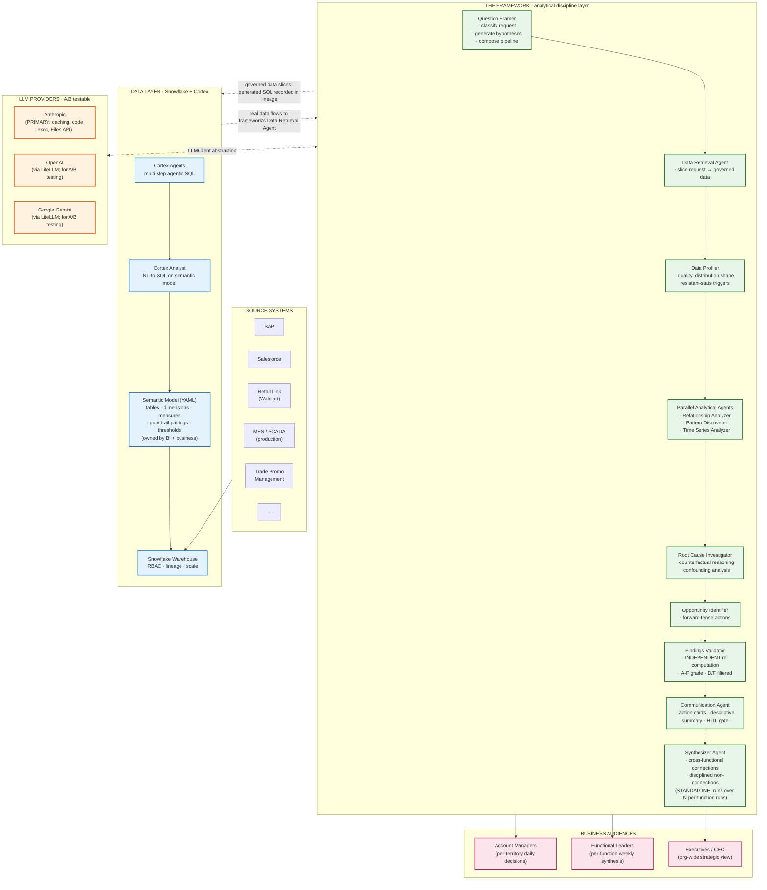
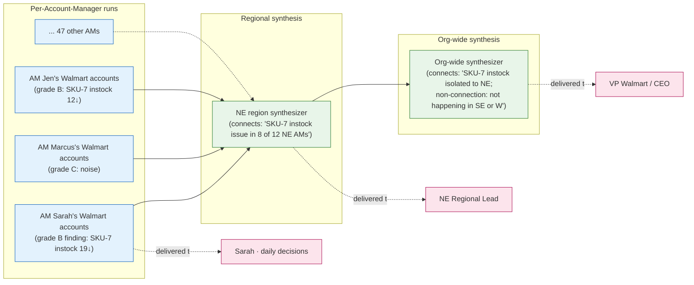

# Agentic Data Analyst — Architecture

## One-paragraph positioning

This framework is the **analytical discipline layer** that sits between governed enterprise data (Snowflake + Cortex) and validated business decisions (Account Managers, functional leaders, executives). It is not a query tool, not a BI dashboard, not a notebook assistant — it is a multi-agent system that applies senior-data-analyst-level rigor (independent validation, A-F confidence grading, causation-vs-correlation gates, null-result-as-output discipline, cross-functional synthesis) to data nobody has time to manually examine. Microsoft Fabric Agents and Snowflake Cortex Agents do per-function analytics; this framework adds the validated cross-functional discipline on top.

---

## Layered architecture



---

## Why this is the right architecture

### Three-layer separation of concerns

| Layer | Responsibility | What it OWNS | What it does NOT own |
|---|---|---|---|
| **Data layer** (Snowflake + Cortex) | Governed access to enterprise data | RBAC, lineage, semantic model, SQL generation, query execution | Analytical discipline; rigor; presentation |
| **Framework** (this repo) | Analytical discipline over the data slice | Validation, confidence grading, causation language, synthesis | Data access, governance, semantic meaning |
| **LLM providers** | Inference on prompts the framework constructs | The model itself | Anything else |

This separation is what makes the framework **portable across data layers**. The same framework runs over:
- A CSV on disk (today — demo data)
- A Snowflake query via direct SQL (transitional)
- Cortex Analyst with a governed semantic model (production)
- Cortex Agents for multi-step workflows (advanced production)

The framework doesn't know or care which one is feeding it. The Data Retrieval Agent is the seam.

### Provider-agnostic LLM access

The framework relies on Anthropic-specific features for production economics (prompt caching saves ~5-10× cost on this workload). But the agent logic is provider-agnostic via the `LLMClient` abstraction. To test which provider gives best results:

```yaml
# config/pipeline_config.yaml
model_per_agent:
  question-framer: claude-sonnet-4-6           # Anthropic, native
  data-profiler: claude-sonnet-4-6              # Anthropic, native
  findings-validator: openai/gpt-5              # OpenAI, via LiteLLM
  communication-agent: google/gemini-3-pro      # Gemini, via LiteLLM
```

The framework dispatches each agent's call to the right provider transparently. Caveat: non-Anthropic providers don't have prompt caching, so production economics favor Anthropic primary. The abstraction is for A/B testing and provider risk hedging, not for runtime provider switching.

---

## What this framework adds that Fabric Agents / Cortex Agents do NOT

| Capability | Microsoft Fabric Agents | Snowflake Cortex Agents | THIS FRAMEWORK |
|---|---|---|---|
| Natural-language query against governed warehouse | ✅ strong | ✅ best-in-class | ❌ (uses Cortex for this) |
| **Independent validator with non-bypassable filtering** | ❌ | ❌ | ✅ |
| **A-F confidence grading + required caveat propagation** | ❌ | ❌ | ✅ |
| **Causation-vs-correlation language gates** | ❌ | ❌ | ✅ |
| **Null-result-as-output discipline** ("nothing concerning this week") | ❌ | ❌ | ✅ |
| **Skill-based methodology versioning** | ❌ | ❌ | ✅ |
| **Cross-functional synthesis with rigor** | ❌ | ❌ | ✅ |
| **Multiple-comparison correction by default** | ❌ | ❌ | ✅ |
| **Simpson's Paradox mandatory check** | ❌ | ❌ | ✅ |
| **Power analysis on null findings** | ❌ | ❌ | ✅ |
| **Human-in-the-loop gate on high-stakes findings** | ❌ | ❌ | ✅ |
| **Tracking-gaps as a product feature** | ❌ | ❌ | ✅ |
| Enterprise UI / Power BI integration | ✅ best-in-class | ⚠️ growing | ❌ |
| Direct warehouse-scale compute | ✅ via Fabric | ✅ native | ❌ (uses Cortex) |

The pattern: **Fabric and Cortex Agents are the data and query layers; this framework is the discipline layer that turns retrieved data into validated, calibrated findings.** The combination is what an enterprise needs; neither alone is sufficient.

---

## The cross-functional synthesis pattern (Walmart In-Store Execution example)

The strongest demonstration of the framework's value: hierarchical synthesis from per-Account-Manager runs up through regional and org-wide views.



Each layer's audience gets the report calibrated to their decision scope. Account Managers get daily AM-level signals; regional leads get the cross-AM pattern picture; executives get the org-wide synthesis. The same data flows through; the framework calibrates audience-by-audience.

**The Synthesizer's discipline keeps this honest:** it only connects findings that already exist in the source runs (no inventing), caps connection grades at the weakest constituent finding's grade, applies confounding analysis on every connection, and surfaces non-connections explicitly. A leader reading the org-wide synthesis can trust that the patterns named are real and the patterns NOT named have been actively looked for.

---

## File-system layout

```
agents/              · 11 agent definitions (markdown)
skills/
  universal/         · always loaded with every agent call (8 skills)
  analytical/        · loaded on demand by analytical agents
  validation/        · loaded by Findings Validator
  output/            · loaded by Communication Agent
  domain-specific/   · CPG-specific methodology
context/
  domains/           · domain context documents (deployment authored, post-business-meeting)
  examples/          · template + reference examples
  semantic_models/   · Cortex Analyst semantic models (BI authored, governed)
src/
  orchestrator/      · pipeline executor, prompt assembler, budget tracker, lineage,
                       HITL gate, schemas (Pydantic), normalizers
  api/               · LLMClient abstraction · ClaudeClient (Anthropic native) ·
                       LiteLLMClient (OpenAI, Gemini, Azure, Bedrock)
  data_access/       · SnowflakeClient · CortexAnalystClient · CortexAgentClient ·
                       Excel/CSV loader · injection defenses
  observability/     · structured JSON logger · tracer · lineage tracker
  delivery/          · (Phase 2) scheduled jobs, Slack/email
  tools/             · replay_comms · synthesize_runs · extract_context_gaps
config/              · pipeline_config.yaml · cost pricing · HITL threshold · etc.
tests/               · 90+ tests including mock-SDK integration tests
docs/                · this file, plus per-skill and per-agent docs
output/              · rendered reports (one per run · HITL-gated when configured)
runs/                · per-run artifacts, JSONL logs, span traces, lineage
```

---

## Production deployment phases

| Phase | Data path | LLM | Status |
|---|---|---|---|
| **MVP demo** (June 2-6 2026) | CSV on disk; demo data hand-curated | Anthropic primary | Current |
| **Phase D1: Direct Snowflake connector** | `SnowflakeClient.execute_query` for known-safe queries | Anthropic | Scaffolded, raises NotImplemented until creds |
| **Phase D2: Cortex Analyst + semantic model** | `CortexAnalystClient.ask` against governed YAML semantic model | Anthropic primary; provider A/B testable | Scaffolded; semantic model authored by BI + business |
| **Phase D3: Cortex Agents** | `CortexAgentClient.run_workflow` for multi-step | Anthropic primary | Scaffolded |
| **Phase 2: Delivery + observability** | Scheduled jobs, Slack/email, LangSmith / Phoenix observability | Anthropic primary | Deferred |

The clean separation between framework and data layer means each phase upgrades a clearly-bounded piece without touching the others. Phase D2 doesn't change agent logic; Phase D3 doesn't change validation; Phase 2 doesn't change discipline. That bounded modifiability is the architectural moat.
