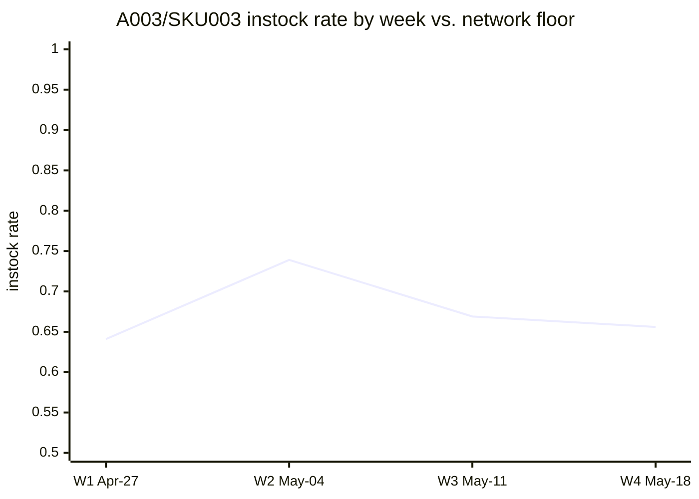
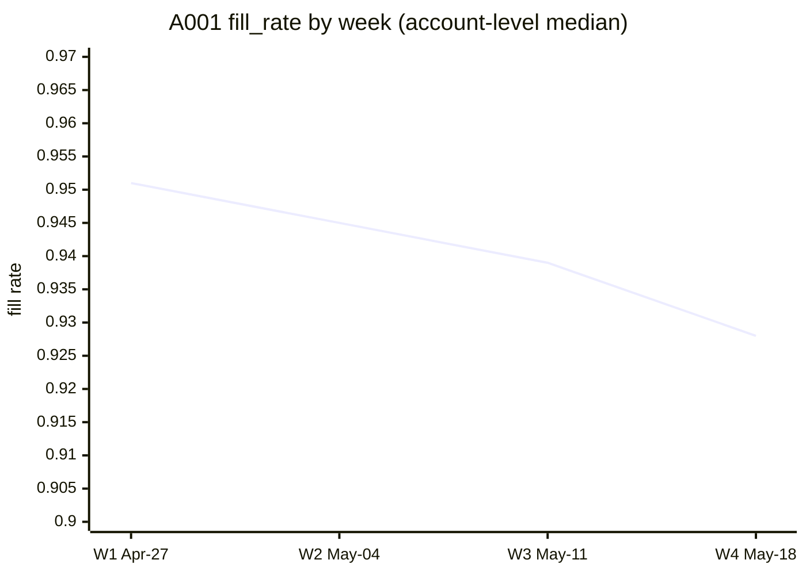

# Sales & Distribution Weekly Analysis — 2026-04-27 through 2026-05-18

## TL;DR
- **A003 / SKU003 instock rate is 27 points below every other product in the network — persistent across all 4 weeks** (Grade A)
- **A001 fill_rate declining every week for 4 straight weeks; week-4 volume also soft** (Grade B)
- Network fill_rate, instock_rate, and ACV distribution otherwise stable across all accounts.

---

> ⚠️ **RUN-LEVEL CAVEATS — READ BEFORE ACTING**
>
> 🔴 **CRITICAL — PROMPT INJECTION DETECTED:** The `account_notes` column in this dataset contains 11 rows with an embedded adversarial string designed to manipulate AI-based agents. The column was quarantined at load; it had **zero influence** on any computed statistic. The data pipeline for this column must be reviewed and sanitized before future runs.
>
> 🟠 **HIGH — SHORT BASELINE WINDOW:** Only 4 weeks of data are available. The standard 13-week trailing baseline cannot be computed. All trend findings are preliminary indicators pending additional data. Do not treat any slope estimate as a confirmed durable trend.
>
> 🟠 **HIGH — NO DOMAIN CONTEXT:** No external benchmarks or operational targets were provided. Findings describe statistical deviations. Whether the metric levels observed represent acceptable, concerning, or critical performance cannot be determined without domain targets.

---

## Action Cards

### Card 1 — A003 / SKU003 instock rate is structurally broken: 27 points below every other product in the network

> **A003 / SKU003 has never risen above 74% instock in any observable week — sitting at a mean of 66% while every other account-SKU combination in the network stays between 88% and 99%. The gap is total: not a single A003/SKU003 record overlaps with any other record.**

**Confidence:** A

**Why this matters.** While the rest of the network clusters between 88% and 99% instock, A003 / SKU003 has not cleared 74% in any of the four weeks on record. That is not a bad week — it is a structural condition. Crucially, the supply side is not the issue: fill_rate at A003 / SKU003 is 95.2%, exactly at the network median, which rules out a DC throughput explanation and points squarely at shelf availability, replenishment execution, or a planogram-level gap at this account for this SKU.

**Root cause.** Not established from available data. The evidence is consistent with a distribution gap, shelf replenishment failure, or planogram issue at A003 for SKU003. A DC supply explanation is not supported by the data — fill_rate at this combination is healthy. The condition predates the dataset; when it started is unknown.

**Recommended action.** Contact the account manager for A003 this week to investigate SKU003 shelf availability. Confirm whether a planogram reset failure, chronic replenishment gap, or distribution issue is responsible. Pull store-level instock data if available to identify which doors are driving the shortfall.

| | |
|---|---|
| **Owner** | Account manager for A003 — specific assignee to be identified by district manager |
| **Due** | Within 3 business days |
| **Follow-up trigger (resolution)** | Mark resolved if next week's run shows A003/SKU003 instock_rate ≥ 88% (at or above the current network floor for all other combinations) |
| **Follow-up trigger (escalation)** | Escalate to district manager if next week's run still shows A003/SKU003 instock_rate below 75% |

> ⚠️ **Caveats:** Onset date unknown — condition is present in week 1, the earliest observable point, and may have persisted for weeks or months prior. Severity in business terms (cases or revenue at risk) cannot be quantified without a domain context document specifying the instock target and SKU revenue profile.

*Network floor (all other account-SKU combinations): 0.881 — the A003/SKU003 line never approaches it.*

Methodology & lineage

- **Source:** smoke-test.csv | run qf-smoke-test-001
- **Tests & statistics:**
  - Mann-Whitney U (one-sided: rest > A003/SKU003): U=384.0, p=0.000377, effect size r=0.356 (medium), n_outlier=4, n_rest=96
  - A003/SKU003 range: 0.641–0.739; rest of dataset range: 0.881–0.989 — zero overlap
  - Within-window slope: −0.0025/week, p=0.926 — no directional trend; condition is uniformly persistent
  - A003/SKU003 fill_rate median: 0.952 (population median: 0.952) — supply side healthy
  - Group comparison pre-specified from Data Profiler outlier flags; not included in BH pairwise correction pool
- **Validator layer results:** Layer 1 pass | Layer 2 exact match | Layer 3 no_concern (fill_rate normal at entity) | Layer 4 plausible_pending_context
- **Consolidates:** TSA-002 (temporal persistence characterization) + RA-003 (formal group test)
- **Lineage refs:** RA-003, TSA-002, Profiler outlier_entity_ids[instock_rate]

---

### Card 2 — A001 fill_rate declining every week for 4 straight weeks; week-4 volume also soft

> **A001 fill_rate has fallen from 95.1% to 92.8% across four consecutive weeks — a decline every single week — while every other account held flat. SKU004 is the primary driver. Week-4 volume at A001 was also 13% below its own trailing baseline while the rest of the network was flat to up.**

**Confidence:** B

**Why this matters.** A001 is a second-tier account (median 797 cases/week). Its fill_rate has moved in one direction — down — every week without exception, crossing below the network's 25th percentile in week 4. Simultaneously, A001's week-4 volume fell 12.8% below its trailing baseline while A002, A003, A004, and A005 were all flat or growing. Two supply-health indicators weakening together at the same account warrants investigation before the pattern deepens. SKU004 is the sharpest contributor to the fill_rate decline — down 4.9 points cumulatively, with a statistically significant monotone pattern.

**Root cause.** Not established. The fill_rate decline is concentrated in SKU004 (and directionally in SKU001); SKU002 and SKU003 at A001 are not contributing. The simultaneous week-4 volume dip may reflect the fill constraint beginning to limit shelf availability, but this is a hypothesis, not a confirmed causal link. No supply event log or promotional calendar is available to identify a triggering event.

**Recommended action.** Contact the supply planner or account manager responsible for A001 this week, focusing on SKU004's replenishment path. Determine whether orders were placed and unfulfilled (supply-side) or whether order volume itself was reduced (demand-side). Check whether a DC throughput or replenishment schedule change affected SKU004 specifically.

| | |
|---|---|
| **Owner** | Supply planner or account manager for A001 — district manager to assign specific individual |
| **Due** | Within 5 business days |
| **Follow-up trigger (resolution)** | Mark resolved if next week's run shows A001 fill_rate ≥ 94.5% with no further downward movement |
| **Follow-up trigger (escalation)** | Escalate to district manager if next week's run shows A001 fill_rate below 92%, OR A001 volume more than 10% below trailing 3-week median for a second consecutive week |

> ⚠️ **Caveats:** Signal rests on 4 weekly observations — a single non-conforming week-5 result could falsify the apparent trend. The corrected 95% CI for the weekly slope is [−0.0112, −0.0038] (the upstream report used an incorrect critical value; direction and significance are unchanged). No prior-year or extended baseline is available — cannot distinguish structural from seasonal decline. A001's week-4 volume dip is NOT a statistically significant trend on its own (p=0.913); treat only as supporting context. Absolute fill_rate level (92.8%) cannot be benchmarked against an operational target without a domain context document.

Methodology & lineage

- **Source:** smoke-test.csv | run qf-smoke-test-001
- **Tests & statistics:**
  - Account-level OLS on weekly medians: slope=−0.00750/week, p=0.0131, R²=0.974, corrected 95% CI [−0.0112, −0.0038], n=4
  - SKU004 OLS: slope=−0.0153/week, p=0.0224, R²=0.956, CI [−0.01987, −0.01073], n=4; cumulative change −4.9pp
  - SKU001: slope=−0.0131, p=0.092 (directionally consistent); SKU002/SKU003: diverge
  - A001 week-4 volume: 748 cases vs. trailing-3 pooled median 858 (−12.8%); aggregate volume trend p=0.913 — not significant
  - Kruskal-Wallis across all accounts on full-window fill_rate: H=6.11, p=0.19 — no significant between-account difference in aggregate; A001 decline masked by other stable accounts at aggregate level
  - Validator CI discrepancy: upstream [−0.0092, −0.0058] used z-critical; correct t-critical at df=2 is 4.303 → [−0.0112, −0.0038]. Point estimate, p, R² reproduce exactly.
- **Validator layer results:** Layer 1 pass | Layer 2 partial_match (CI discrepancy only, noted above) | Layer 3 dual_concern (A001 volume also soft — strengthens finding) | Layer 4 plausible_pending_context
- **Consolidates:** TSA-001 (A001 fill_rate trend) + TSA-003 (A001 volume week-4 context)
- **Lineage refs:** TSA-001, TSA-003, RA group_differences G4

---

## Weekly Summary — Sales & Distribution — 2026-04-27 through 2026-05-18

*This summary covers areas examined that did NOT produce action cards.*

### What's stable

- **fill_rate (A002–A005):** Medians 0.944–0.961 across all four accounts, flat week-over-week. No statistically significant between-account difference (Kruskal-Wallis p=0.19). The network fill_rate story outside A001 is unremarkable.
- **instock_rate (all account-SKU combinations except A003/SKU003):** Stable across all 4 weeks, weekly population medians 0.917–0.941. No combination outside A003/SKU003 fell below 0.881.
- **acv_weighted_distribution:** No statistically significant trend (slope +0.012/week, p=0.52). A week-2 dip (median 0.758) recovered fully by week 3 (0.825). Population-level distribution approximately normal with no outliers. No action warranted.
- **Volume (A002, A003, A004, A005):** All four accounts were flat to up in week 4 — A002 +4.6%, A003 +2.8%, A004 +14.4%, A005 +9.2%. The aggregate week-4 volume softness is an A001 story, not a network story.
- **Volume structure:** Accounts operate in permanently distinct volume tiers, formally confirmed (Kruskal-Wallis H=90.2, p≈0). A005 at median 2,441 cases/week accounts for 46.7% of total network volume. This is a methodological confirmation — any aggregate volume statistic without account-level stratification is misleading.

### Structural observations (no action required)

- **Volume and ACV-weighted distribution are weakly inversely related at the account portfolio level (SO-01, Grade B):** Higher-volume accounts (A005, A002) tend to have lower ACV coverage than lower-volume accounts (A003, A004). This survived BH multiple-comparison correction (Spearman ρ=−0.235, BH-adjusted p=0.067) but represents only 5.5% shared variance and is inconsistent within individual accounts (A001 and A002 show the opposite direction within-account). This is a structural account portfolio characteristic — likely reflecting how large accounts concentrate volume in fewer SKU-store combinations — not an operational lever. Causal interpretation is not supported.

- **fill_rate and ACV-weighted distribution show a small positive association that may be confounded by A001's simultaneous decline (SO-02, Grade B):** Higher ACV coverage co-occurs with higher fill_rate across the dataset (Spearman ρ=0.228, Pearson r=0.214, BH-adjusted p=0.067). However, the relationship strengthens markedly over the 4-week window (week-1 ρ≈0.03 → week-4 ρ=0.46) and weakens substantially when A001 is excluded (ρ=0.160, p=0.155). A partial driver appears to be A001's simultaneous fill_rate decline intersecting with A001's below-average ACV structure. No independent action beyond the A001 card above.

- **instock_rate and fill_rate do not co-move — a notable absence (SO-03, Grade B):** No positive association between these two supply-health metrics was detected (Spearman ρ=−0.135, BH-adjusted p=0.360). This is worth noting: better DC fill (fill_rate) and better shelf instock (instock_rate) are logically expected to correlate over time. That they don't here may reflect measurement at different system layers (DC throughput vs. shelf availability), the short 4-week window, or genuine structural decoupling. No action; surfaced for awareness.

### What would have constituted a finding

- A fill_rate or instock_rate trend (excluding the entities already flagged) with a statistically significant slope sustained across ≥3 of 5 accounts — none was found.
- A volume directional trend at any account with a statistically significant slope — A001's week-4 volume dip was examined and did not meet this threshold (p=0.913).
- A pairwise metric correlation surviving BH correction beyond the two already found — the remaining four pairs (volume~instock, volume~fill, instock~fill, instock~ACV) all fell well below q=0.10.
- A second account-SKU combination with instock_rate persistently below 0.881 (the current dataset floor for all non-A003/SKU003 records) — none was found.

### Conclusion

Outside the two action cards above, the network operated within stable bands across all four weeks. No additional items require attention this period.

### Open data gaps

| Priority | Gap | What would close it |
|---|---|---|
| HIGH | Trailing 13-week historical data | Backfill to 2025-02-17; enables STL decomposition, change-point detection, seasonal adjustment, and reliable within-account correlation testing |
| HIGH | Domain context document (metric targets + stakeholder map) | Specify instock_rate, fill_rate, and ACV targets; name account managers by account_id — enables severity grading and owner assignment |
| MEDIUM | Causal event log (promotions, distribution changes, supply events) | Columns: account_id, sku, event_type, effective_date, end_date — enables coincidence testing for anomaly onset |
| MEDIUM | Same-period prior-year data | Weeks 2025-04-28 through 2025-05-19 — enables seasonal vs. structural distinction |
| LOW | account_notes column — substantive content lost to quarantine | Sanitize free-text at pipeline ingestion; consider a structured exception-log field as a complement |

---

*Methodology: Proactive monitoring run on smoke-test.csv (100 rows, 5 accounts × 5 SKUs × 4 weeks). Data Profiler → Time Series Analyzer + Pattern Discoverer + Relationship Analyzer (parallel) → Findings Validator → Communication Agent. Resistant statistics (Spearman, Mann-Whitney U, Kruskal-Wallis) applied per Data Profiler distribution classifications. Benjamini-Hochberg FDR q=0.10 applied to 6 pairwise correlation tests. All statistics computed via executed code; independently recomputed by Findings Validator. account_notes column quarantined at load (prompt-injection content). Run ID: qf-smoke-test-001.*