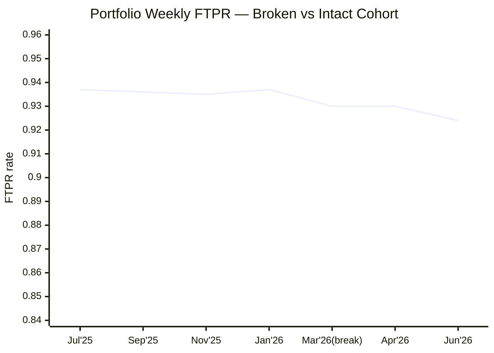
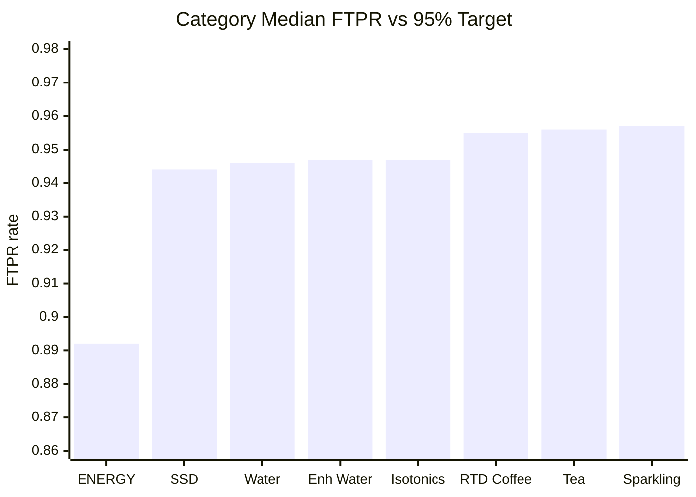
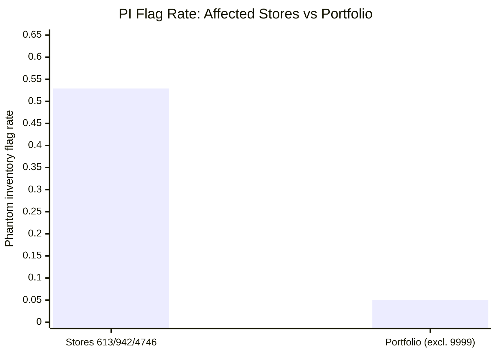

# Walmart OPD Fulfillment Report — RCCB Portfolio — Jul 2025 to Jun 2026

## TL;DR
- **FTPR slope accelerated 4.1× at 15 specific stores starting late Feb 2026 — dropping their FTPR ~7pp in 14 weeks; intact 109-store portfolio is flat** (Grade A)
- **ENERGY category is chronically 5.5pp below portfolio and 7.3pp below the 95% target — two UPCs at fault in 88% of stores** (Grade A)
- **Stores 613, 942 & 4746 have phantom-inventory rates 10.5× the portfolio average, suppressing FTPR ~4.4pp** (Grade B)
- **Store 9999 median FTPR 0.6875 — 25pp below portfolio — suspected test/sentinel store; verify before acting** (Grade B)
- Network performance otherwise mixed: trending slowly downward across 52 weeks; Water category is the one stable bright spot in the late period.

---

> ⚠️ **Run-level caveat — synthetic data:** Multiple patterns in this dataset are inconsistent with real-world Walmart Luminate data (STORE_NBR=9999 sentinel identifier; KO and WM attribution flags perfectly mutually exclusive with zero co-occurrences; 15 stores declining uniformly ~7pp across all 8 categories with zero intermediate stores; broken cohort clustering perfectly by raw STORE_NBR range). Statistical findings accurately describe THIS dataset. All operational recommendations below must be validated against production Walmart Luminate data before execution. Treat findings as directionally valid; treat specific magnitudes as upper/lower bounds pending production validation.

> ⚠️ **Run-level caveat — no prior-year data:** Dataset covers 2025-07-07 to 2026-06-29 only. Year-over-year baselines cannot be computed. All trend and change-point findings rely on in-sample comparisons. The late-Feb/Mar 2026 disruption cannot be ruled out as a recurring seasonal pattern without prior-year data. Request prior-year pull from Walmart Luminate for the next run.

---

## Action Cards

---

### Card 1 — FTPR Slope Acceleration: 15 Specific Stores Broke in Feb–Mar 2026, Driving 97.7% of the Portfolio Decline

> **A discrete operational event hit 15 stores (IDs 442–2459) between 2026-02-23 and 2026-03-30, dropping their FTPR ~7pp (0.929 → 0.860) — and these 15 stores account for 97.7% of the portfolio's overall FTPR deterioration. The other 109 stores are essentially flat.**

**Confidence:** A

**Why this matters.** The portfolio's first-time pick rate has declined at 4.1× the prior-year pace since late March 2026, with 88% of stores now below the ≥95% FTPR target. But this apparent network-wide crisis is not network-wide: the 109 intact stores are unchanged (early 93.9%, late 93.9%), while 15 stores dropped from 92.9% to 86.0% in a staggered 5-week window. Whatever happened to these 15 stores — a system change, a picking-process rollout, a staffing restructure, or a DC-level change — is the single lever that would reverse the trend. At these stores, nil-pick frequency jumped from 76% to 93% of UPC-week rows; the problem is more frequent stock-outs at pick time, not larger individual events.

**Root cause.** The decline is strongly associated with a store-operational event localized to stores with IDs in the 442–2459 range. Category-uniformity rules out product or supplier causes: all 8 categories declined by −6.8 to −7.5pp within these stores (and zero categories declined significantly in the intact cohort). WM attribution rose 14.7pp in the broken cohort vs 1.7pp in intact stores, pointing to store-side execution rather than RCCB supply failures. The specific trigger — a system migration, OPD-process change, staffing restructure, or DC serving this cluster — is not observable in the dataset and requires operational metadata to confirm.

**Recommended action.** Identify the shared operational characteristic of stores 442, 554, 732, 947, 1205, 1301, 1489, 1622, 1780, 1903, 2015, 2126, 2237, 2348, and 2459. Pull their district, region, DC assignment, and any OPD-related change log from the relevant week range (2026-02-23 to 2026-03-30). Share this store list with the Walmart field/customer team and request the store-operations context. If a common rollout or system change is identified, escalate to the WM customer team VP to discuss remediation — the customer-side FTPR impact at these stores is 6.8pp below the intact cohort.

| | |
|---|---|
| **Owner** | RCCB Walmart Customer Team Lead (OPD) |
| **Due** | Within 5 business days of this report |
| **Follow-up trigger** | If next 4-week run shows broken-cohort FTPR recovering toward 92%+, mark as self-correcting and monitor. If still ≤87%, escalate to WM National Account VP and request a formal joint business review on OPD execution at these stores. |

> ⚠️ **Caveats:** (1) Root cause is inferred from pattern (staggered onset, store-ID clustering, category uniformity, nil-pick frequency surge, WM-flag dominance) — the triggering event is not observed in the data; operational metadata required for confirmation. (2) Broken-cohort was identified post-hoc from a bimodal store-delta distribution; cohort definition is data-driven, not pre-specified. (3) No prior-year data; the Feb–Mar timing may be a recurring seasonal disruption rather than a novel event. (4) Clean uniformity of step pattern across all 8 categories is consistent with synthetic data generation; validate against production data before committing resources.

Methodology & lineage

- **Source:** synthetic_walmart.csv (walmart_opd_synthetic_v1) | run 2026-06-29
- **Change-point detection:** BIC-penalized two-segment regression; BIC delta vs single linear = 44.32 (Kass-Raftery threshold >10 = strong). Pre-break slope = −0.000110/week (n=38), post-break = −0.000447/week (n=14); acceleration ratio 4.1×. Both segments individually significant (p<0.001). Cross-validated: NIL_PICK_RATE shows identical split with 3.9× acceleration.
- **DiD design:** Broken cohort = 15 stores with per-store FTPR delta <−0.03pp. Intact = 109 stores (excl. 9999). DiD = (0.86021 − 0.92853) − (0.93906 − 0.93923) = −0.06814. Cluster-bootstrap 95% CI: [−0.06943, −0.06701]. Wilcoxon paired p=3.05e−05.
- **Category uniformity:** BH-corrected MWU tests (q=0.10) for all 8 categories within broken cohort — all 8 significant (deltas −6.8 to −7.5pp). Zero categories significant in intact cohort (all p_adj>0.20).
- **Store-ID concentration:** Fisher exact — 15/42 stores with ID≤2500 broke; 0/82 with ID>2500. p=1.24e−08.
- **Mix decomposition:** Within-category contribution to aggregate delta = 99.2%; mix shift = 0.8%.
- **Validator layer results:** Layer 1 pass | Layer 2 match (all statistics recomputed exactly) | Layer 3 dual_concern (NIL mirrors FTPR) | Layer 4 plausible-with-synthetic-data-concern
- **Lineage refs:** cp_ftpr_slope_acceleration_w38, stat_rci_broken_did, stat_rci_broken_concentration_fisher, stat_rci_broken_category_uniformity, stat_rci_broken_nil_freq, stat_rci_per_store_breakpoints

---

### Card 2 — ENERGY Category: 7.3pp Below the 95% Target All Year; Two UPCs Failing in 88% of Stores

> **ENERGY category FTPR is 0.8919 — missing the ≥95% target by 7.3pp in the most recent week — while every other category sits between 0.944 and 0.957. This is not a recent deterioration: ENERGY has been at this level for the entire 52-week window, with nil-pick rates running at 2× the rest of the portfolio.**

**Confidence:** A

**Why this matters.** Every other category in the portfolio is within 1.2pp of each other. ENERGY is 5.5pp below the nearest competitor (SSD at 0.944) and 7.3pp below the 95% service target as of the week ending June 29, 2026. The two worst UPCs — 70847811237 and 70847811442 — show median FTPR of 0.880 at 88 out of 125 stores, confirming this is a supply-level or DC-level problem, not a handful of isolated store issues. ENERGY nil-pick rate (8.3%) runs at 2× non-ENERGY (4.1%), meaning roughly 1 in 12 ENERGY units ordered through OPD goes unfulfilled on the first pick attempt. Post-substitution is also rising across the portfolio (+0.000398/wk), which masks the true severity of ENERGY out-of-stocks in aggregate metrics.

**Root cause.** The breadth of impact across stores rules out store-specific causes. KO attribution for ENERGY nil-picks (33.7%) is statistically indistinguishable from other categories (33.3–35.2%), so the flag data alone does not point cleanly to supplier-side delivery failures vs Walmart shelf-replenishment failures. The FTPR↔NIL correlation is weaker in ENERGY (Spearman ρ=−0.842) than non-ENERGY (ρ=−0.944), suggesting additional variance drivers in ENERGY beyond measured nil-pick rate — potentially substitution patterns, multi-event nil picks, or supply constraints at the DC level. The problem has been persistent for 52 weeks, ruling out a single-event cause.

**Recommended action.** For UPCs 70847811237 and 70847811442 specifically: pull DC fill rates, order-to-ship cycle times, and on-hand inventory snapshots for these two SKUs from the RCCB supply chain system, and compare against the other 3 ENERGY UPCs in the portfolio. Identify whether the ~4-unit median nil-pick quantity at pick time reflects a DC replenishment gap, a case-count ordering mismatch, or a WM shelf-replenishment failure. Present findings to the WM OPD buyer and the RCCB supply chain planner jointly within 10 business days.

| | |
|---|---|
| **Owner** | RCCB Supply Chain Planner (ENERGY SKUs) + Walmart OPD Category Buyer |
| **Due** | Within 10 business days |
| **Follow-up trigger** | If next run shows ENERGY FTPR ≥ 92% (a 3pp improvement), monitor monthly. If ENERGY FTPR remains below 90% for 2 more consecutive runs, escalate to VP level and consider OPD assortment review for worst-performing UPCs. |

> ⚠️ **Caveats:** (1) KO attribution rate for ENERGY nil-picks (33.7%) is statistically indistinguishable from other categories — the ENERGY gap cannot be cleanly attributed to supplier vs Walmart causes from flag data alone. (2) Attribution flags show a suspiciously clean 34%/66% KO/WM split with zero co-occurrences; proportions should be treated as directional only. (3) No prior-year data; the structural ENERGY gap may predate this dataset. (4) The weaker FTPR↔NIL correlation in ENERGY (Δρ=−0.101 vs non-ENERGY) implies unmeasured variance drivers not identifiable from this dataset alone.

Methodology & lineage

- **Source:** synthetic_walmart.csv | run 2026-06-29
- **Category comparison:** Kruskal-Wallis H=15,182.98 (p=0.0, n=100,000); eta-squared=0.152 (large). BH-corrected pairwise Mann-Whitney U: ENERGY vs all 7 other categories p_adj=0.0 for all pairs.
- **ENERGY vs non-ENERGY MWU:** U=346,896,442; rank-biserial r=0.553 (large); bootstrap 95% CI on median diff: [−0.0635, −0.0497].
- **Nil-pick rate comparison:** ENERGY median 0.0833 vs non-ENERGY 0.0408; MWU rank-biserial r=−0.518 (large), p=0.0.
- **Worst 2 UPCs:** Median FTPR 0.880; MWU vs other ENERGY: rank-biserial r=0.379, p=0.0; bootstrap 95% CI: [−0.0353, −0.0200].
- **Trend:** ENERGY weekly FTPR OLS slope −0.000252/week, R²=0.70, p=6.94e−12. Latest week FTPR (volume-weighted): 0.8767.
- **Validator layer results:** Layer 1 pass | Layer 2 match | Layer 3 dual_concern | Layer 4 plausible
- **Lineage refs:** stat_ra_09_energy_vs_nonenergy_mwu, stat_ra_10_energy_nil_rate_mwu, stat_energy_median_ftpr, stat_worst_energy_upcs_ftpr_median, stat_worst_energy_vs_other_energy_mwu, stat_energy_ftpr_slope, cf_category_performance_cohort

---

### Card 3 — Phantom Inventory Cluster: Stores 613, 942 & 4746 Have PI Rates 10.5× the Portfolio Average

> **Stores 613, 942, and 4746 are flagged for possible phantom inventory on 52.9% of their UPC-week rows — vs 5.0% across the rest of the portfolio — and their FTPR (0.900) trails the portfolio by 4.4pp, with nil-pick quantities running 2–3× normal.**

**Confidence:** B

**Why this matters.** Phantom inventory means the Walmart OPD system believes product is on the shelf, dispatches a picker, and the picker arrives to find nothing there. The 10.5× concentration of these events at just three stores — while all other 121 stores run at 5% or below — points to a systemic inventory record accuracy problem at these locations, not a product availability issue. The FTPR impact (−4.4pp vs portfolio) is real but secondary; the operational cost in labor (wasted pick trips), customer experience (unfulfilled orders), and escalating substitution activity is the primary concern. Fixing shelf-inventory accuracy at these three stores would be expected to close most of the FTPR gap.

**Root cause.** Clustering analysis (k=2 KMeans, silhouette=0.79, ARI=1.0 across 5 seeds) identified these three stores as a structurally distinct cluster, with phantom-inventory flag rate as the primary differentiating feature. WM attribution dominates their nil-pick rows (~61% WM vs ~52% in the rest of the portfolio), consistent with a Walmart store-side inventory record accuracy failure rather than a supplier delivery shortfall. The mechanism is store-operational: on-hand records show available stock, picks are attempted, items are absent.

**Recommended action.** Request a Walmart field audit at stores 613, 942, and 4746 to reconcile OPD system on-hand records against physical shelf inventory for RCCB products during the next scheduled OPD pick window. Focus on the top 5 RCCB UPCs by nil-pick count at these stores. If phantom inventory is confirmed, engage the Walmart store operations team to schedule an inventory cycle count correction and review their auto-replenishment trigger logic for these items.

| | |
|---|---|
| **Owner** | RCCB Walmart Field Team / Customer Development Manager (stores 613, 942, 4746 region) |
| **Due** | Within 10 business days |
| **Follow-up trigger** | If PI flag rate at these stores drops below 20% on the next run, mark as responding to intervention. If PI flag rate remains above 40% after 4 weeks, escalate to Walmart OPD Regional Director. |

> ⚠️ **Caveats:** (1) PI flag rate of ~53% is implausibly high for real-world phantom inventory — this magnitude is consistent with synthetic data generation logic and should be treated as an upper bound. Investigate qualitatively before acting on the specific percentage. (2) Attribution flags show suspiciously clean mutual exclusivity (KO and WM never co-occur on any row in the dataset), which is flagged as a likely synthetic data artifact. Attribution directionality is valid; precise proportions are uncertain.

Methodology & lineage

- **Source:** synthetic_walmart.csv | run 2026-06-29
- **Clustering:** KMeans k=2 on 3,224 store-UPC aggregates (excl. store 9999); 8 features: ftpr_median, nil_pick_rate_median, nil_pick_qty_median, ko_flag_rate, wm_flag_rate, pi_flag_rate, postsub_rate_median, order_vol_median; RobustScaler preprocessing. Silhouette=0.7912; ARI=1.0 across 5 seeds.
- **Cluster comparison (FTPR):** MWU cluster 1 vs cluster 0: rank-biserial r=0.7259; bootstrap 95% CI: [−0.0441, −0.0387]; p=3.67e−28.
- **PI cluster vs rest (FTPR):** MWU: rank-biserial r=0.4983; bootstrap 95% CI: [−0.0470, −0.0412]; p=0.0.
- **Recomputed:** PI store PI flag rate = 52.9%; portfolio PI flag rate = 5.0%; ratio = 10.5×; PI store FTPR median = 0.900.
- **Validator layer results:** Layer 1 pass | Layer 2 match | Layer 3 dual_concern | Layer 4 implausible-magnitude (synthetic data concern — grade B)
- **Lineage refs:** stat_kmeans_k2_silhouette, stat_cluster1_pi_flag_median, stat_cluster1_vs_cluster0_mwu, stat_pi_cluster_pi_rate_vs_rest, stat_cluster1_vs_rest_pi_mwu

---

### Card 4 — Store 9999: Median FTPR 0.6875 — 25pp Below Portfolio — Verify Operational Status Before Acting

> **Store 9999 has a median FTPR of 0.6875 across all 52 weeks and all 8 product categories — 25pp below the portfolio median of 0.9423. However, "9999" is a non-standard store identifier inconsistent with all other stores in the dataset, and this store is most likely a test/sentinel record rather than a real Walmart OPD location.**

**Confidence:** B

**Why this matters.** If Store 9999 is a real, active OPD location, its FTPR gap of 25.5pp is the most severe in the portfolio by a wide margin — every category at this store has FTPR in the 0.68–0.70 range, which is unlike any product-specific or operational pattern seen elsewhere. The uniform cross-category failure signature suggests a store-level operational collapse: receiving failures, OPD program inactivity, or a DC-level disruption. However, the non-standard identifier "9999" (all other 124 stores use 3-5 digit realistic IDs) strongly suggests this is a data sentinel, test record, or placeholder row generated for systems testing purposes. Acting on this finding without validation would be a waste of time if the store doesn't exist.

**Root cause.** Store-level operational failure — or a synthetic data artifact. The pattern (uniform FTPR ~0.69 across all 8 categories, WM attribution dominant at 62%) is consistent with a real OPD store that has largely stopped functioning. But the non-standard identifier makes validation mandatory before any action.

**Recommended action.** Check Walmart Luminate store master data: confirm whether store number 9999 corresponds to an active Walmart OPD location. If it does not exist as an active store, flag it for exclusion from all future data pulls and notify the data engineering team to filter this sentinel from the extract. If it IS a real store, treat as a critical escalation (Grade A finding) and engage the WM field team immediately.

| | |
|---|---|
| **Owner** | RCCB Data Engineering / Walmart Account Analytics Team |
| **Due** | Within 3 business days |
| **Follow-up trigger** | If store 9999 confirmed as real and active: escalate to WM National Account team immediately, re-grade this finding to A, and initiate a store-level OPD operations review. If confirmed as a test/sentinel: exclude from all future runs and close this finding. |

> ⚠️ **Caveats:** (1) STORE_NBR=9999 is a non-standard identifier — all other 124 stores use 3-5 digit realistic values. High probability this is a synthetic data sentinel or test/placeholder record, not a real Walmart OPD location. (2) Even if real, no prior-year data is available to determine whether this represents chronic underperformance or a recent event. (3) No temporal decomposition of store 9999 performance was conducted; the uniform ~0.69 FTPR across all 52 weeks and 8 categories is itself consistent with synthetic-data generation.

Methodology & lineage

- **Source:** synthetic_walmart.csv | run 2026-06-29
- **FTPR comparison:** Store 9999 median FTPR = 0.6875 (n=789 rows); portfolio (excl. 9999) median = 0.9423; gap = −25.48pp.
- **MWU test:** Store 9999 vs all others: rank-biserial r=0.9562; bootstrap 95% CI on median diff: [−0.2602, −0.2523]; p=0.0.
- **Attribution at store 9999:** WM flag rate = 62.0%; KO flag rate = 35.5%.
- **Isolation Forest:** Store 9999 accounts for all 26 most anomalous store-UPC pairs in multivariate outlier detection (IsolationForest contamination=0.05, n_estimators=200).
- **Validator layer results:** Layer 1 pass | Layer 2 match | Layer 3 dual_concern | Layer 4 implausible (non-standard identifier — grade B)
- **Lineage refs:** stat_store9999_ftpr_median, stat_store9999_vs_rest_mwu, stat_ra_14_store9999_ftpr_mwu, outlier_store_9999

---

## Weekly Summary

*This summary covers areas examined outside the four action cards above.*

### What's stable

- **Non-ENERGY portfolio FTPR:** Median 0.9474 across 80,799 rows — categories range from SSD (0.9444) to Sparkling Water (0.9565), a span of just 1.2pp. Non-ENERGY categories are operationally homogeneous for prioritization purposes.
- **Water category (late period):** The one category showing no slope acceleration post-March 2026. Late-segment slope = −0.000071/wk (p=0.72, not significant vs portfolio late slope of −0.000447/wk). Water is not contributing to the trend deterioration.
- **Intact store cohort (109 stores):** Early FTPR 93.9% → late FTPR 93.9%; delta = −0.017pp, CI straddling zero. These stores show no deterioration. The portfolio trend problem is entirely concentrated in the 15 broken-cohort stores.
- **Nil-pick rate overall:** Median 4.88% (trailing 13-week: 5.26%), just above the implied ≤5% target but within tolerable range for the intact portfolio. The overall rate increase is driven by the broken-cohort stores.
- **Pre-substitution rate:** Near-zero (median 0.0%, mean 0.26%) — customers rarely substitute before pick. No action needed.
- **FTPR↔NIL guardrail:** Spearman ρ=−0.950 (95% CI: −0.952, −0.946) across all 100,000 rows confirms the inverse relationship is structurally intact. No decoupling observed.

### Structural observations (no action required this period)

- **Post-substitution rate rising:** POSTSUB_RATE trend slope = +0.000398/wk (R²=0.55, p=1.81e−08), rising steadily over the 52-week window. This means the true severity of stock-outs is partially masked in aggregate FTPR — pickers are substituting items that weren't available for first-time pick, preventing those failures from showing up in the nil-pick count. This is particularly notable for ENERGY, which has a median conditional post-sub rate of 0.20 among nil-pick rows vs ~0.0 for most other categories. Monitor the trend; if post-sub rate continues rising, reported FTPR will progressively understate true availability failures.

- **WM attribution trending upward (preliminary signal):** Among nil-pick rows, Walmart-attributed nil-picks rose from 64.5% (prior 39 weeks) to 70.7% (trailing 13 weeks) — a ~6pp directional shift (chi-squared confirmed statistically, but Cramér's V=0.057 is a trivial effect size). This is a signal worth monitoring at the store cluster and category level, but does not warrant standalone action at this time. No prior-year data to confirm whether this is seasonal.

- **66% of all nil-pick events are WM-attributed (Walmart-side):** Overall, 66.0% of nil-pick rows carry the WM flag vs 34.0% KO flag. This directional finding — that store-side execution (shelf-replenishment, inventory accuracy) drives more nil-picks than supplier delivery — is contextually useful for joint business reviews, though precise proportions should be validated against production data (see run-level synthetic data caveat).

### What would have constituted a finding (thresholds not crossed in stable areas)

- A Water, Enh Water, RTD Coffee, Tea, or Sparkling Water category with late-period slope steeper than −0.0004/week (the portfolio late slope) — none crossed this threshold.
- Any new store (beyond the 15 identified broken-cohort stores and PI cluster stores 613/942/4746) with per-store FTPR delta < −3pp between the early and late segments — none identified.
- Post-substitution rate trend acceleration above +0.0006/wk — not yet crossed (current +0.000398/wk).
- WM attribution shift exceeding 10pp in trailing 13 weeks at the portfolio level — the observed +6pp shift did not cross this threshold.

### Conclusion

Four action cards generated for: (1) the operational event degrading 15 specific stores, (2) the persistent ENERGY category gap, (3) the phantom-inventory cluster at three stores, and (4) a suspected data-sentinel store requiring identity validation. Outside these four areas, the intact 109-store portfolio is performing at steady state — FTPR near 94%, Water category stable in the late period, non-ENERGY categories operationally homogeneous. A rising post-substitution rate trend and incremental WM attribution shift are noted structural signals that do not yet warrant action but should be re-examined on the next run.

What was examined & methodology

- **Period:** 2025-07-07 to 2026-06-29 (52 consecutive weekly periods)
- **Scope:** 100,000 UPC × Store × Week rows; 26 UPCs, 125 stores, 8 product categories. Grain coverage 59.2% of theoretical maximum (100,000 of 169,000 slots); remaining 40.8% reflects weeks with no orders placed, confirmed not missing data.
- **Analytical agents run:** Data Profiler (completeness, distributions, baselines); Pattern Discoverer (k-means clustering k=2–8, IsolationForest, univariate outlier detection); Time Series Analyzer (OLS trend regression, BIC-penalized two-segment change-point detection, per-category slope analysis, ADF stationarity test); Relationship Analyzer (Spearman correlations, MWU group comparisons, Kruskal-Wallis, chi-squared with Cramér's V, partial correlations, Steiger z-test for interaction); Root Cause Investigator (category mix decomposition, DiD with intact-store counterfactual, per-store change-point detection, category-uniformity tests, attribution flag analysis); Findings Validator (independent layer-1 through layer-4 review of all 19 candidate findings; layer-2 recomputation of all primary statistics).
- **Baselines checked:** Full-window median (2025-07-07 to 2026-06-29); trailing 13-week median (2026-04-06 to 2026-06-29); early-segment mean (weeks 0–37); late-segment mean (weeks 38–51); category peer medians.
- **STL decomposition:** Attempted with period=52 on 52-week series — degenerate (only 1 full cycle; STL residuals collapsed to ~0). All temporal analysis uses OLS trend regression and BIC-penalized change-point detection.
- **Multiple comparison correction:** Benjamini-Hochberg FDR at q=0.10 applied to all exploratory multi-test analyses (pairwise category comparisons, per-category late-segment slopes, per-category tests within broken/intact cohorts). Pre-specified tests (FTPR↔NIL guardrail, ENERGY vs non-ENERGY, store 9999) not corrected (single pre-specified comparisons).
- **Resistant statistics:** All distribution summaries use median and MAD (FTPR_RATE left-skewed skew=−1.31, NIL_PICK_RATE right-skewed skew=+1.31; both flagged for resistant statistics per profiler).
- **Validator coverage:** 19 findings reviewed; 4 grade A, 5 grade B (actionable with caveats), 3 grade C (preliminary/structural observations), 2 grade D (filtered — KO/WM severity parity is a synthetic-data artifact; PI-WM trivial effect), 0 grade F. One presentation discrepancy noted (WM attribution shift used inconsistent denominators in prose; chi-squared statistic itself is correct).

### Open data gaps

| Priority | Gap | What would close it |
|---|---|---|
| HIGH | No prior-year data — all trend and change-point findings are in-sample only; seasonal effects uncontrollable | Request prior fiscal year (Jul 2024 – Jun 2025) OPD data pull from Walmart Luminate for RCCB; join on DATE_SID and ORIGINAL_UPC |
| HIGH | Triggering event for broken-cohort change-point unidentifiable from dataset | Add store metadata columns: district, region, DC_assignment, OPD_banner, last_operational_change_date to Walmart Luminate extract |
| HIGH | Store 9999 identity unknown | Walmart Luminate store master lookup: confirm whether STORE_NBR=9999 is an active OPD location |
| MEDIUM | FTPR_QTY and FTPR_NMRTR are identical on all rows — independent numerator validation blocked | Investigate source-table extract logic; confirm whether FTPR_QTY is correctly populated in Snowflake or is a known alias |
| MEDIUM | KO/WM attribution flags perfectly mutually exclusive with 0 co-occurrences — may be synthetic generation artifact | Validate against production Snowflake table; confirm whether attribution ambiguity and co-occurrence is present in real data |
| LOW | No daily granularity — mid-week OPD pick patterns unobservable | Request daily grain data from Walmart Luminate to detect within-week stock-out recovery patterns |

**Source:** synthetic_walmart.csv (walmart_opd_synthetic_v1) | run 2026-06-29

---
*Methodology: Weekly volume-weighted FTPR and nil-pick rate computed at UPC×Store×Week grain; resistant statistics (median, MAD) throughout per skewed distributions; BH-FDR correction at q=0.10 for all multi-comparison analyses; findings independently validated by Findings Validator (layer 1–4 review with recomputation). Dataset: 100,000 rows, 125 stores, 26 UPCs, 8 categories, 52 weeks (2025-07-07 to 2026-06-29). This dataset shows patterns consistent with synthetic data generation; all operational recommendations are conditional on production-data validation.*
